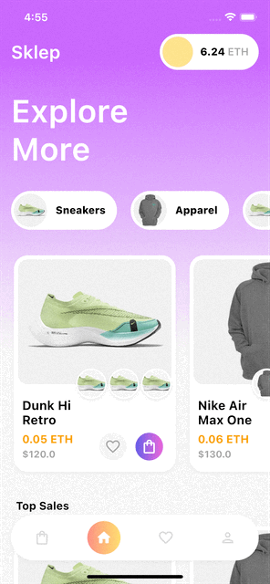
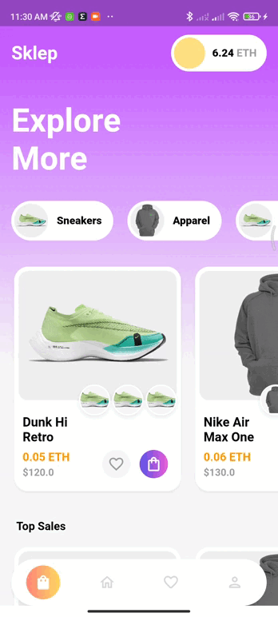
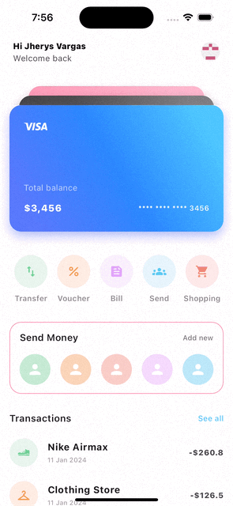

# Fancy designs made in Flutter

Personal project to capture designs for mobile apps in projects made with flutter

## Inspiration sources

<table>
  <tbody>
    <tr>
      <td align="center" style="background-color: white">
        
      </td>
      <td align="center" style="background-color: white">
        
      </td>
    </tr>
  </tbody>
</table>

## Sklep™ E-commerce App.

[Original design](https://dribbble.com/shots/20647659-Sklep-E-commerce-App)

<table>
  <tbody>
    <tr>
      <td align="center">
        
        

          iOS
        

      </td>
      <td align="center">
        
        

          Android
        

      </td>
    </tr>
  </tbody>
</table>

## Banking App.

[Original design](https://dribbble.com/shots/15363093/attachments/7124653?mode=media)

<table>
  <tbody>
    <tr>
      <td align="center">
        
        

          iOS
        

      </td>
      <td align="center">
        
        

          Android
        

      </td>
    </tr>
  </tbody>
</table>
